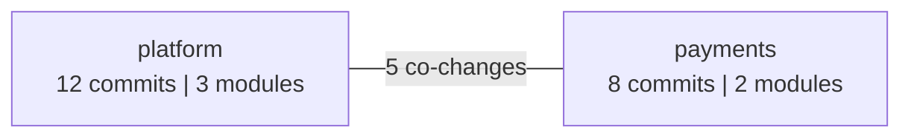

# dx-metrics

[](https://codecov.io/gh/pfazzi/dx-metrics)

CLI tool that reads **Git commit history** to surface hidden organisational friction in software teams.

It answers questions like:
- *Which modules always change together — and are different teams forced to touch them?*
- *Who really owns what? Is declared ownership still accurate?*
- *Is my team quietly taking over another team's territory?*
- *Which files are completely stale — owned by nobody?*

No instrumentation, no process changes. Just point it at a Git repository.

---

## Quick start

```bash
composer install

# Scaffold config + team template from your Git history
./dx-metrics init /path/to/repo

# Edit .dx-metrics-teams.json — move emails from _unassigned into named teams
# Then run any analysis:
./dx-metrics coupling:analyze /path/to/repo
```

When new developers join, sync them without touching existing assignments:

```bash
./dx-metrics init --update /path/to/repo
```

---

## Configuration

Place `.dx-metrics.json` in the repository root. CLI flags always take precedence.

```json
{
  "teams": ".dx-metrics-teams.json",
  "depth": 2,
  "filter": "src/",
  "exclude": ["*.lock", "vendor/*"],
  "min-teams": 2,
  "min-coupling": 0,
  "period": "4w"
}
```

Generate it automatically with `init` (see below).

---

## Commands

### `init` — Bootstrap configuration

```bash
./dx-metrics init <path> [--force]
./dx-metrics init <path> --update
```

**First run**: scans Git authors from the last 12 months, auto-detects the source directory, and writes two files:

- **`.dx-metrics.json`** — main config with all tunable defaults
- **`.dx-metrics-teams.json`** — team template with discovered authors in `_unassigned`:

```json
{
  "teams": { "platform": [], "payments": [] },
  "_unassigned": ["alice@example.com"],
  "_unassigned_details": {
    "alice@example.com": { "name": "Alice Smith", "example_commit": "a1b2c3d..." }
  }
}
```

`_unassigned_details` includes the author name and a commit SHA so you can identify aliases (`git show <sha>`).

**`--update`**: re-scans Git and appends authors not yet assigned to any team. Existing assignments are never touched.

---

### `coupling:analyze` — Volatility coupling

Finds files that change together across commits. A high co-change count between two files from different teams is an implicit dependency that forces coordination.

```bash
./dx-metrics coupling:analyze <path> [options]
```

| Option | Short | Description |
|---|---|---|
| `--since` | `-s` | Include commits after this date |
| `--until` | `-u` | Include commits before this date |
| `--threshold` | `-t` | Minimum co-changes to show a pair (default: 0) |
| `--filter` | `-f` | Restrict to files under this path prefix |
| `--exclude` | | Exclude files matching this glob (repeatable) |
| `--output-dir` | `-o` | Directory for `coupling.dot` / `coupling.png` (default: CWD) |

Outputs a table of file pairs sorted by co-change count, and writes `coupling.dot` and `coupling.png` (requires [Graphviz](https://graphviz.org/)).

---

### `coupling:trend` — Cross-team coupling over time

Tracks the **company coupling index** — the fraction of co-changes that cross team boundaries — across configurable time windows. Use this to see whether team boundaries are improving or degrading over time.

```bash
./dx-metrics coupling:trend <path> --teams=teams.json [options]
```

| Option | Short | Description |
|---|---|---|
| `--teams` | `-T` | Path to the teams JSON config (required) |
| `--period` | | Window size, e.g. `4w`, `1m`, `3m` (default: `4w`) |
| `--depth` | `-d` | Path segments that define a module (default: 2) |
| `--since` | `-s` | Start of the analysis window |
| `--until` | `-u` | End of the analysis window |
| `--filter` | `-f` | Restrict to files under this path prefix |
| `--exclude` | | Exclude files matching this glob (repeatable) |

Output per period: company index, cross-team co-changes, per-team coupling score, and top coupling pairs.

---

### `coupling:map` — Team territory map

Generates a **visual graph** of teams and their cross-team coupling — one node per team, edges weighted by co-change count. A thick edge is a Conway's Law violation: two teams sharing code changes without a shared owner.

```bash
./dx-metrics coupling:map <path> --teams=teams.json [options]
```

| Option | Short | Description |
|---|---|---|
| `--teams` | `-T` | Path to the teams JSON config (required) |
| `--depth` | `-d` | Path segments that define a module (default: 2) |
| `--filter` | `-f` | Restrict to files under this path prefix |
| `--min-coupling` | `-c` | Hide edges below this co-change count (default: 0) |
| `--since` | `-s` | Include commits after this date |
| `--until` | `-u` | Include commits before this date |
| `--exclude` | | Exclude files matching this glob (repeatable) |
| `--output-dir` | `-o` | Directory for output files (default: CWD) |
| `--format` | | `dot` (default) or `mermaid` |

**`--format=dot`** writes `territory.dot` and `territory.png` (requires [Graphviz](https://graphviz.org/)).

**`--format=mermaid`** prints or writes a `territory.mmd` file embeddable directly in GitHub/GitLab markdown:

````markdown

````

---

### `ownership:list` — Shared ownership

Lists files touched by multiple teams, ranked by ownership entropy (0 = single owner, 1 = perfectly contested). Use this to find where Conway's Law is violated at the file level.

```bash
./dx-metrics ownership:list <path> --teams=teams.json [options]
```

| Option | Short | Description |
|---|---|---|
| `--teams` | `-T` | Path to the teams JSON config (required) |
| `--since` | `-s` | Include commits after this date |
| `--until` | `-u` | Include commits before this date |
| `--filter` | `-f` | Restrict to files under this path prefix |
| `--exclude` | | Exclude files matching this glob (repeatable) |
| `--min-teams` | `-m` | Minimum teams touching a file to include it (default: 2) |

---

### `ownership:hotspots` — High-risk shared files

Ranks shared files by **risk score = entropy × commit frequency**. A file that is both highly contested and frequently changed is the most urgent to clarify.

```bash
./dx-metrics ownership:hotspots <path> --teams=teams.json [options]
```

Same options as `ownership:list`. Output sorted by risk score descending:

```
+------------------+--------+-------+------------------+---------+------------+
| File             | Commits| Teams | Dominant Team    | Entropy | Risk Score |
+------------------+--------+-------+------------------+---------+------------+
| src/Order.php    | 87     | 3     | platform (40%)   | 0.91    | 79.2       |
| src/Invoice.php  | 34     | 2     | payments (55%)   | 0.79    | 26.9       |
+------------------+--------+-------+------------------+---------+------------+
```

---

### `ownership:trend` — Entropy drift over time

Tracks **ownership entropy per module** across time windows. Use this to detect gradual territory drift — a module whose entropy is steadily rising is being quietly colonised by another team.

```bash
./dx-metrics ownership:trend <path> --teams=teams.json [options]
```

| Option | Short | Description |
|---|---|---|
| `--teams` | `-T` | Path to the teams JSON config (required) |
| `--period` | | Window size, e.g. `4w`, `1m`, `3m` (default: `4w`) |
| `--depth` | `-d` | Path segments that define a module (default: 2) |
| `--since` | `-s` | Start of the analysis window |
| `--until` | `-u` | End of the analysis window |
| `--filter` | `-f` | Restrict to files under this path prefix |
| `--exclude` | | Exclude files matching this glob (repeatable) |

---

### `ownership:gaps` — Stale, unmaintained files

Finds files with **no recent commits** — code that nobody is actively maintaining. Useful for identifying dead code, deprecated modules, or files that have quietly lost their owner.

```bash
./dx-metrics ownership:gaps <path> [options]
```

| Option | Short | Description |
|---|---|---|
| `--since` | `-s` | Files with no commits after this date are flagged (default: `-6 months`) |
| `--filter` | `-f` | Restrict to files under this path prefix |
| `--exclude` | | Exclude files matching this glob (repeatable) |

---

### `ownership:init` — Scaffold teams config from Git history

Scans Git author history and generates a teams JSON template with all discovered emails in `_unassigned`.

```bash
./dx-metrics ownership:init <path> [--output=teams.json] [--since=2024-01-01]
```

> **Tip**: prefer `init` (see above) which also generates `.dx-metrics.json` alongside the teams file.

---

### `codeowners:suggest` — Generate CODEOWNERS from history

Generates a `CODEOWNERS` draft by assigning each module to its dominant team based on recent commit history.

```bash
./dx-metrics codeowners:suggest <path> --teams=teams.json [options]
```

| Option | Short | Description |
|---|---|---|
| `--teams` | `-T` | Path to the teams JSON config (required) |
| `--depth` | `-d` | Path segments that define a module (default: 2) |
| `--github-org` | | Format owners as `@org/team-slug` instead of `@team-slug` |
| `--output` | | Write to a file instead of stdout |
| `--since` | `-s` | Include commits after this date (default: `-6 months`) |
| `--filter` | `-f` | Restrict to files under this path prefix |
| `--exclude` | | Exclude files matching this glob (repeatable) |

Modules where no team has more than 50% of commits are marked with `(!)` — contested ownership that should be resolved before committing to CODEOWNERS.

---

### `codeowners:drift` — CODEOWNERS accuracy check

Compares your declared `CODEOWNERS` against recent commit history. Drift is the percentage of commits to a pattern's files that came from teams other than the declared owner. High drift means the file has a new de-facto owner that isn't reflected in CODEOWNERS.

```bash
./dx-metrics codeowners:drift <path> --teams=teams.json [options]
```

| Option | Short | Description |
|---|---|---|
| `--teams` | `-T` | Path to the teams JSON config (required) |
| `--codeowners` | | Path to CODEOWNERS file (auto-detected if omitted) |
| `--filter` | `-f` | Restrict analysis to files under this path prefix |
| `--since` | `-s` | Include commits after this date (default: `-6 months`) |
| `--until` | `-u` | Include commits before this date |
| `--exclude` | | Exclude files matching this glob (repeatable) |

Auto-detects `CODEOWNERS` in `./`, `.github/`, or `docs/` (GitHub/GitLab convention). Patterns with 0% drift are marked `ok`; above 10% trigger a `review` warning.

---

## How modules are defined

The `--depth` option controls how many path segments define a module boundary:

| `--depth` | File | Module |
|---|---|---|
| `1` | `src/Domain/Order/OrderService.php` | `src` |
| `2` | `src/Domain/Order/OrderService.php` | `src/Domain` |
| `3` | `src/Domain/Order/OrderService.php` | `src/Domain/Order` |

Start with `--depth=2` and adjust until the granularity matches your architectural boundaries.

---

## Ownership entropy

Ownership entropy measures how contested a file or module is:

- **0.0** — one team made all commits (clear owner)
- **0.5** — two teams split commits roughly 75/25
- **1.0** — all teams contributed equally (no owner)

Shannon entropy normalised to [0, 1] over the team distribution of commits.
